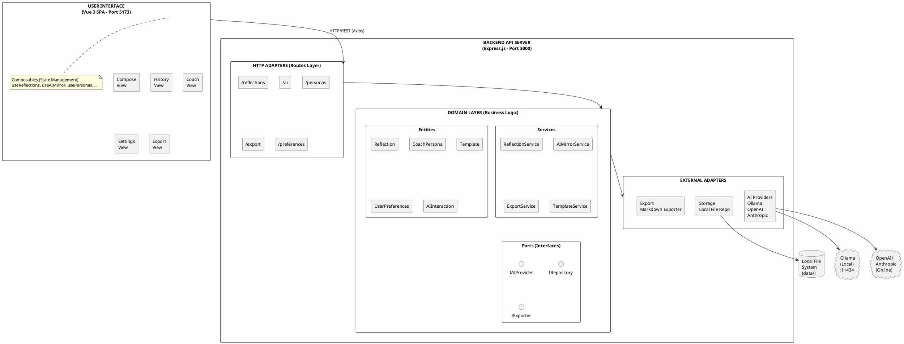
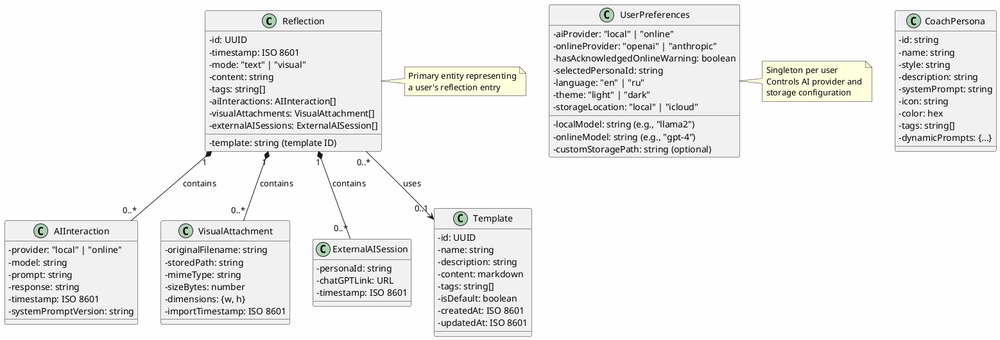
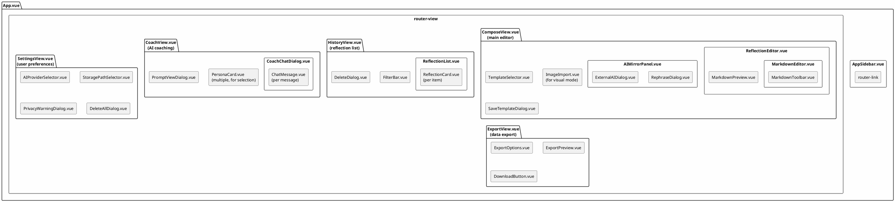

# 🏗️ Architecture Documentation - Laboratory of Life

> **Last Updated**: 2026-01-31  
> **Version**: 1.1.0  
> **Maintainers**: Keep this document in sync with structural changes (see [Maintenance Guidelines](#maintenance-guidelines))

---

## Table of Contents

1. [Overview](#overview)
2. [System Architecture](#system-architecture)
3. [Technology Stack](#technology-stack)
4. [Directory Structure](#directory-structure)
5. [Domain Model](#domain-model)
6. [API Design](#api-design)
7. [Data Flow](#data-flow)
8. [Component Architecture](#component-architecture)
9. [Design Patterns](#design-patterns)
10. [Integration Points](#integration-points)
11. [Use Cases](#use-cases)
12. [Security & Privacy](#security--privacy)
13. [Maintenance Guidelines](#maintenance-guidelines)

---

## Overview

**Laboratory of Life** is a local-first, privacy-focused personal reflection application that helps users document their thoughts with optional AI assistance. The application follows **Hexagonal Architecture** principles to maintain clean separation between business logic and external dependencies.

### Core Principles

1. **Privacy First**: All data stored locally by default, no external tracking
2. **Local-First**: Operates offline, AI assistance is optional
3. **Clean Architecture**: Hexagonal/Ports & Adapters pattern
4. **Extensibility**: Easy to add new AI providers, storage backends, or export formats
5. **Accessibility**: WCAG 2.1 AA compliant, full keyboard navigation
6. **Data Sovereignty**: Export and delete capabilities with zero friction

---

## System Architecture

### High-Level Architecture Diagram



### Hexagonal Architecture Layers

#### **1. Domain Layer (Core)**
- **Location**: `backend/src/domain/`
- **Purpose**: Contains all business logic, independent of external frameworks
- **Contents**:
  - **Entities**: Core domain models with validation (Zod schemas)
  - **Services**: Orchestration logic (use cases)
  - **Ports**: Interface definitions for external dependencies

#### **2. Adapters Layer (External)**
- **Location**: `backend/src/adapters/`
- **Purpose**: Implements port interfaces, connects domain to external systems
- **Contents**:
  - **HTTP Adapters**: Express routes, middleware, request/response mapping
  - **AI Adapters**: Ollama, OpenAI, Anthropic implementations
  - **Storage Adapters**: File system repositories
  - **Export Adapters**: Markdown exporter

#### **3. Configuration Layer**
- **Location**: `backend/src/config/`
- **Purpose**: Environment-specific settings, validation
- **Contents**: Server config, AI endpoints, storage paths

---

## Technology Stack

### Backend
| Technology | Purpose | Version |
|------------|---------|---------|
| **Node.js** | Runtime environment | 18+ |
| **Express.js** | HTTP server & routing | 4.18.2 |
| **Zod** | Schema validation | 3.22.4 |
| **Multer** | File upload handling | 2.0.2 |
| **Vitest** | Testing framework | 1.0.4 |
| **Supertest** | HTTP integration tests | 7.1.4 |

### Frontend
| Technology | Purpose | Version |
|------------|---------|---------|
| **Vue 3** | UI framework (Composition API) | 3.3.11 |
| **Vite** | Build tool & dev server | 5.0.8 |
| **Vue Router** | Client-side routing | 4.2.5 |
| **Axios** | HTTP client | 1.6.2 |
| **Marked** | Markdown parsing | 11.2.0 |
| **DOMPurify** | XSS protection | 3.3.0 |
| **Radix Vue** | Accessible UI primitives | 1.2.7 |
| **Playwright** | E2E testing | 1.40.1 |
| **axe-core** | Accessibility testing | 4.11.0 |

### External Services
| Service | Purpose | Default |
|---------|---------|---------|
| **Ollama** | Local AI (LLaMA, Mistral, etc.) | ✅ Enabled |
| **OpenAI API** | Cloud AI (ChatGPT) | ⚠️ Opt-in only |
| **Anthropic API** | Cloud AI (Claude) | ⚠️ Opt-in only |

---

## Directory Structure

```
Life-Laborarory/
├── backend/                              # Node.js backend API
│   ├── src/
│   │   ├── domain/                       # 🔵 CORE: Business logic
│   │   │   ├── entities/                 # Domain models (Zod validated)
│   │   │   │   ├── Reflection.js         # Main entity
│   │   │   │   ├── CoachPersona.js       # AI coach definitions
│   │   │   │   ├── Template.js           # Reflection templates
│   │   │   │   ├── UserPreferences.js    # Settings
│   │   │   │   ├── AIInteraction.js      # AI response tracking
│   │   │   │   ├── VisualAttachment.js   # Image metadata
│   │   │   │   ├── predefined-personas.js # Default coaches
│   │   │   │   └── persona-prompts/      # Dynamic prompt files
│   │   │   ├── services/                 # Business logic orchestration
│   │   │   │   ├── ReflectionService.js  # CRUD operations
│   │   │   │   ├── AIMirrorService.js    # AI generation
│   │   │   │   ├── ExportService.js      # Export to Markdown
│   │   │   │   ├── TemplateService.js    # Template management
│   │   │   │   ├── PromptFileService.js  # Dynamic prompt loading
│   │   │   │   ├── StoragePathService.js # Storage validation
│   │   │   │   └── ChatGPTLinkGenerator.js # External link gen
│   │   │   ├── ports/                    # Interface definitions
│   │   │   │   ├── IAIProvider.js        # AI provider contract
│   │   │   │   ├── IReflectionRepository.js # Storage contract
│   │   │   │   └── IExporter.js          # Export contract
│   │   │   └── factories/
│   │   │       └── RepositoryFactory.js  # Dynamic repo creation
│   │   ├── adapters/                     # 🟢 ADAPTERS: External integrations
│   │   │   ├── http/                     # REST API
│   │   │   │   ├── routes/               # 10 route modules
│   │   │   │   │   ├── reflections.js    # Reflection CRUD
│   │   │   │   │   ├── ai.js             # AI mirror endpoint
│   │   │   │   │   ├── ai-chat.js        # Multi-turn chat
│   │   │   │   │   ├── ai-rephrasing.js  # Text refinement
│   │   │   │   │   ├── personas.js       # Coach management
│   │   │   │   │   ├── export.js         # Export to Markdown
│   │   │   │   │   ├── preferences.js    # User settings
│   │   │   │   │   ├── templates.js      # Template CRUD
│   │   │   │   │   ├── visuals.js        # Image upload/download
│   │   │   │   │   └── storage.js        # Storage validation
│   │   │   │   └── middleware/
│   │   │   │       ├── validation.js     # Zod validation
│   │   │   │       └── errorHandler.js   # Centralized errors
│   │   │   ├── ai/                       # AI provider adapters
│   │   │   │   ├── OllamaAdapter.js      # Local LLM (default)
│   │   │   │   ├── OpenAIAdapter.js      # ChatGPT
│   │   │   │   ├── AnthropicAdapter.js   # Claude
│   │   │   │   ├── prompts/              # System prompts
│   │   │   │   └── rephrasing-prompts.js # Rephrase templates
│   │   │   ├── storage/                  # Storage adapters
│   │   │   │   ├── LocalFileRepository.js # File system
│   │   │   │   └── LocalPreferencesRepository.js # Settings
│   │   │   └── export/
│   │   │       └── MarkdownExporter.js   # MD export
│   │   ├── config/
│   │   │   └── index.js                  # Configuration & validation
│   │   ├── utils/
│   │   │   └── icloud.js                 # iCloud path detection
│   │   └── server.js                     # Express app entry point
│   ├── tests/
│   │   ├── unit/                         # 16 unit tests
│   │   ├── integration/                  # 5 integration tests
│   │   └── smoke/                        # Smoke tests
│   ├── package.json
│   └── vitest.config.js
│
├── frontend/                             # Vue 3 frontend
│   ├── src/
│   │   ├── views/                        # 5 page components
│   │   │   ├── ComposeView.vue           # Main reflection editor
│   │   │   ├── HistoryView.vue           # Reflection list
│   │   │   ├── CoachView.vue             # AI coaching interface
│   │   │   ├── SettingsView.vue          # User preferences
│   │   │   └── ExportView.vue            # Data export
│   │   ├── components/                   # 20+ reusable components
│   │   │   ├── ReflectionEditor.vue      # Text editor
│   │   │   ├── MarkdownEditor.vue        # Markdown input
│   │   │   ├── MarkdownPreview.vue       # Markdown renderer
│   │   │   ├── ReflectionList.vue        # Timeline
│   │   │   ├── PersonaCard.vue           # Coach selector
│   │   │   ├── AIMirrorPanel.vue         # AI response display
│   │   │   ├── RephraseDialog.vue        # Text refinement UI
│   │   │   ├── CoachChatDialog.vue       # Multi-turn chat
│   │   │   ├── ImageImport.vue           # Visual upload
│   │   │   ├── TemplateSelector.vue      # Template picker
│   │   │   └── ...                       # Other UI components
│   │   ├── composables/                  # Vue 3 composition functions
│   │   │   ├── useReflections.js         # Reflection state
│   │   │   ├── useAIMirror.js            # AI generation
│   │   │   ├── useRephrasing.js          # Text refinement
│   │   │   ├── usePersonas.js            # Coach management
│   │   │   ├── usePreferences.js         # User settings
│   │   │   ├── useTemplates.js           # Template state
│   │   │   └── ...                       # Other state logic
│   │   ├── services/
│   │   │   └── api.js                    # Axios HTTP client
│   │   ├── router/
│   │   │   └── index.js                  # Vue Router config
│   │   ├── utils/
│   │   │   ├── markdown.js               # MD parsing/rendering
│   │   │   └── markdownShortcuts.js      # Keyboard shortcuts
│   │   ├── styles/                       # Design system
│   │   │   ├── main.css                  # Base styles
│   │   │   ├── animations.css            # Transitions
│   │   │   └── accessibility.css         # WCAG compliance
│   │   └── main.js                       # App entry point
│   ├── tests/
│   │   ├── unit/                         # Component tests
│   │   └── e2e/                          # Playwright tests
│   ├── package.json
│   ├── vite.config.js
│   └── playwright.config.js
│
├── data/                                 # 🔒 LOCAL STORAGE (gitignored)
│   ├── reflections/                      # User reflections
│   │   └── YYYY-MM/                      # Month-based organization
│   │       └── {uuid}.json               # Individual reflection files
│   ├── visuals/                          # Uploaded images
│   ├── exports/                          # Generated Markdown files
│   └── preferences.json                  # User settings (singleton)
│
├── docs/                                 # Documentation
│   ├── user-guide.md
│   └── quickstart.md
│
├── specs/                                # Feature specifications
│   └── 000-product-vision/
│       ├── spec.md                       # Product vision
│       ├── plan.md                       # Implementation plan
│       ├── data-model.md                 # Entity definitions
│       ├── contracts/                    # API contracts
│       └── tasks.md                      # Task breakdown
│
├── ARCHITECTURE.md                       # 📘 This document
├── REFACTORING-PROPOSALS.md              # Code quality proposals
├── README.md                             # User guide
├── CHANGELOG.md                          # Version history
└── О-чем-проект.md                      # Personal manifesto (Russian)
```

---

## Domain Model

### Entity Relationship Diagram



### Validation Rules (Zod Schemas)

**Reflection Entity**:
- `id`: Required UUID v4
- `timestamp`: Required ISO 8601 string
- `mode`: Must be "text" or "visual"
- `content`: Required string (max 50,000 chars for text mode)
- `tags`: Optional array of strings
- `template`: Optional string (must reference existing template)
- `aiInteractions`: Array of AIInteraction objects
- `visualAttachments`: Array (required if mode="visual", must have at least 1 item)

**UserPreferences State Machine**:
- If `aiProvider="online"`, then `hasAcknowledgedOnlineWarning` must be `true`
- If `onlineProvider` is set, `onlineModel` must be set
- If `storageLocation="icloud"`, must validate path exists

---

## API Design

### REST API Endpoints

#### **Reflections** (`/api/reflections`)
| Method | Endpoint | Purpose | Request | Response |
|--------|----------|---------|---------|----------|
| GET | `/api/reflections` | List all reflections | Query: `month` (YYYY-MM, optional) | Array of Reflection |
| GET | `/api/reflections/:id` | Get single reflection | Params: `id` (UUID) | Reflection object |
| POST | `/api/reflections` | Create new reflection | Body: ReflectionCreateSchema | Created Reflection |
| DELETE | `/api/reflections/:id` | Delete single reflection | Params: `id` (UUID) | `{ success: true }` |
| POST | `/api/reflections/delete-all` | Delete all reflections | Body: `{ confirmation: "DELETE_ALL" }` | `{ success: true, count: N }` |

#### **AI Mirror** (`/api/ai`)
| Method | Endpoint | Purpose | Request | Response |
|--------|----------|---------|---------|----------|
| POST | `/api/ai/mirror` | Generate AI response | Body: `{ reflectionText, reflectionId, personaId }` | `{ response, model, provider }` |
| POST | `/api/ai/rephrasing` | Rephrase text | Body: `{ text, style, personaId }` | `{ suggestions: [string] }` |

#### **AI Chat** (`/api/ai/chat`)
| Method | Endpoint | Purpose | Request | Response |
|--------|----------|---------|---------|----------|
| POST | `/api/ai/chat` | Multi-turn coaching | Body: `{ messages, personaId }` | `{ response, sessionId }` |

#### **Personas** (`/api/personas`)
| Method | Endpoint | Purpose | Request | Response |
|--------|----------|---------|---------|----------|
| GET | `/api/personas` | List all coaches | - | Array of CoachPersona |
| GET | `/api/personas/:id` | Get single coach | Params: `id` | CoachPersona object |

#### **Export** (`/api/export`)
| Method | Endpoint | Purpose | Request | Response |
|--------|----------|---------|---------|----------|
| POST | `/api/export` | Export to Markdown | Body: `{ format: "single-file" \| "folder", month }` | File download |

#### **Preferences** (`/api/preferences`)
| Method | Endpoint | Purpose | Request | Response |
|--------|----------|---------|---------|----------|
| GET | `/api/preferences` | Get user settings | - | UserPreferences object |
| POST | `/api/preferences` | Update settings | Body: Partial UserPreferences | Updated preferences |

#### **Templates** (`/api/templates`)
| Method | Endpoint | Purpose | Request | Response |
|--------|----------|---------|---------|----------|
| GET | `/api/templates` | List all templates | - | Array of Template |
| POST | `/api/templates` | Create template | Body: TemplateCreateSchema | Created Template |
| DELETE | `/api/templates/:id` | Delete template | Params: `id` (UUID) | `{ success: true }` |

#### **Visuals** (`/api/visuals`)
| Method | Endpoint | Purpose | Request | Response |
|--------|----------|---------|---------|----------|
| POST | `/api/visuals/upload` | Upload image | multipart/form-data | `{ id, url, metadata }` |
| GET | `/api/visuals/:id` | Download image | Params: `id` (UUID) | Image file |
| DELETE | `/api/visuals/:id` | Delete image | Params: `id` (UUID) | `{ success: true }` |

#### **Storage** (`/api/storage`)
| Method | Endpoint | Purpose | Request | Response |
|--------|----------|---------|---------|----------|
| POST | `/api/storage/validate-path` | Validate custom path | Body: `{ path }` | `{ valid: boolean, error? }` |

---

## Data Flow

### Critical User Flows

#### **1. Create Reflection Flow**

```
User writes reflection in ComposeView
    ↓
useReflections.createReflection({ content, mode, tags })
    ↓
Frontend: Validate input locally
    ↓
POST /api/reflections (with ReflectionCreateSchema in body)
    ↓
Backend: validation.js middleware → Zod schema validation
    ↓
ReflectionService.createReflection()
    ├─ Generate UUID
    ├─ Add timestamp
    ├─ Validate content length
    └─ Determine storage month (YYYY-MM)
    ↓
RepositoryFactory.getReflectionRepository()
    ├─ Load UserPreferences
    └─ Return LocalFileRepository (or iCloud variant)
    ↓
IReflectionRepository.save(reflection)
    ├─ Serialize to JSON
    ├─ Write to temp file (atomic write)
    ├─ Rename to final path: data/reflections/YYYY-MM/{uuid}.json
    └─ Verify file exists
    ↓
Return saved reflection with id + timestamp
    ↓
Frontend: Update composable state
    ↓
Display success toast + show reflection in editor
```

#### **2. AI Mirror Response Flow**

```
User clicks "Ask AI Mirror" in ComposeView
    ↓
useAIMirror.generateResponse({ reflectionId, reflectionText, personaId })
    ↓
POST /api/ai/mirror
    ↓
Backend: Load UserPreferences
    ├─ aiProvider = "local" → Use OllamaAdapter
    └─ aiProvider = "online" → Use OpenAIAdapter or AnthropicAdapter
    ↓
AIMirrorService.generateResponse()
    ├─ Load CoachPersona (system prompt)
    ├─ Format prompt with persona + reflection text
    └─ Call IAIProvider.generateResponse(systemPrompt, userMessage, options)
    ↓
AI Adapter makes external API call
    ├─ OllamaAdapter → http://localhost:11434/api/generate
    ├─ OpenAIAdapter → https://api.openai.com/v1/chat/completions
    └─ AnthropicAdapter → https://api.anthropic.com/v1/messages
    ↓
Validate response structure
    ├─ Check for required fields
    ├─ Sanitize output (remove markdown if present)
    └─ Enforce character limits
    ↓
Create AIInteraction entity
    ├─ Record model, provider, timestamp
    └─ Store systemPromptVersion
    ↓
Update reflection with new AIInteraction
    ↓
IReflectionRepository.save(updatedReflection)
    ↓
Return { response, model, provider } to frontend
    ↓
Frontend: Display in AIMirrorPanel component
```

#### **3. Export to Markdown Flow**

```
User clicks "Export to Markdown" in ExportView
    ↓
Select format: "single-file" or "folder"
    ↓
POST /api/export (body: { format, month })
    ↓
Backend: ExportService.export(reflections, format)
    ↓
IReflectionRepository.findAll(month)
    ├─ Load all reflections from data/reflections/YYYY-MM/
    └─ Sort by timestamp descending
    ↓
IExporter.export(reflections, format)
    ├─ MarkdownExporter iterates reflections
    ├─ Convert content to Markdown
    ├─ Include AI interactions as quoted sections
    ├─ Embed visual attachments (if format="folder")
    └─ Generate metadata YAML frontmatter
    ↓
If format="single-file"
    └─ Return single .md file with all reflections
If format="folder"
    ├─ Create ZIP archive
    ├─ Add reflections.md
    └─ Add visuals/ directory with images
    ↓
Frontend: Trigger browser download
    ↓
Display success toast with file size
```

#### **4. Settings Update Flow**

```
User changes AI provider in SettingsView
    ↓
If switching to "online" → Show privacy warning dialog
    ↓
User acknowledges warning
    ↓
usePreferences.updatePreferences({ aiProvider: "online", hasAcknowledgedOnlineWarning: true })
    ↓
POST /api/preferences
    ↓
Backend: Validate with UserPreferences schema
    ├─ State machine validation:
    │   └─ If aiProvider="online" && !hasAcknowledgedOnlineWarning → REJECT
    └─ Write to data/preferences.json
    ↓
Return updated preferences
    ↓
Frontend: Update composable state
    ↓
All AI components now use new provider
```

---

## Component Architecture

### Frontend Component Hierarchy



### Composable Functions (State Management)

| Composable | Purpose | State | Methods |
|------------|---------|-------|---------|
| `useReflections()` | Reflection CRUD | `reflections: Ref<Reflection[]>`, `loading`, `error` | `fetchAll()`, `create()`, `update()`, `delete()` |
| `useAIMirror()` | AI generation | `response: Ref<string>`, `loading`, `error` | `generateResponse()`, `clear()` |
| `useRephrasing()` | Text refinement | `suggestions: Ref<string[]>`, `loading` | `rephrase(text, style)` |
| `usePersonas()` | Coach management | `personas: Ref<CoachPersona[]>`, `selected` | `fetchAll()`, `selectById()` |
| `usePreferences()` | User settings | `preferences: Ref<UserPreferences>` | `fetch()`, `update()`, `reset()` |
| `useTemplates()` | Template state | `templates: Ref<Template[]>` | `fetchAll()`, `create()`, `delete()` |
| `useMarkdownEditor()` | Markdown state | `content: Ref<string>`, `mode: Ref<'edit'\|'preview'>` | `formatBold()`, `insertLink()`, etc. |

---

## Design Patterns

### 1. **Hexagonal Architecture (Ports & Adapters)**
- **Domain Layer**: Business logic, independent of frameworks
- **Ports**: Interfaces (IAIProvider, IReflectionRepository, IExporter)
- **Adapters**: Implementations (OllamaAdapter, LocalFileRepository, etc.)
- **Benefits**: Easy to swap AI providers, storage backends, or export formats without touching domain logic

### 2. **Repository Pattern**
- **Interface**: `IReflectionRepository` defines storage contract
- **Implementation**: `LocalFileRepository` handles file system operations
- **Benefits**: Abstract storage layer, enable future implementations (SQLite, IndexedDB, etc.)

### 3. **Adapter Pattern**
- **Interface**: `IAIProvider` defines AI provider contract
- **Implementations**: `OllamaAdapter`, `OpenAIAdapter`, `AnthropicAdapter`
- **Benefits**: Swap AI providers at runtime based on user preferences

### 4. **Factory Pattern**
- **RepositoryFactory**: Creates appropriate repository based on user preferences
- **Benefits**: Centralized logic for determining storage backend (local vs iCloud)

### 5. **Service Layer Pattern**
- **Services**: `ReflectionService`, `AIMirrorService`, `ExportService`
- **Benefits**: Orchestrate domain entities + external adapters, keep controllers thin

### 6. **Composition Pattern (Vue 3)**
- **Composables**: `useReflections()`, `useAIMirror()`, etc.
- **Benefits**: Reusable stateful logic, better than mixins or inheritance

### 7. **Dependency Injection**
- **Route Handlers**: Accept service instances as parameters
- **Example**: `createPersonasRouter(promptFileService)`
- **Benefits**: Testable, decoupled route handlers

### 8. **Schema Validation (Zod)**
- **All entities** have Zod schemas for runtime validation
- **Middleware**: `validation.js` validates incoming requests
- **Benefits**: Type-safe validation, catch errors early

### 9. **State Machine (UserPreferences)**
- **Rules**: Enforce valid state transitions (e.g., online AI requires warning acknowledgment)
- **Benefits**: Prevent invalid configurations

### 10. **Atomic Writes (Storage)**
- **Pattern**: Write to temp file → rename to final path
- **Benefits**: Prevent data corruption during concurrent writes

---

## Integration Points

### AI Providers

#### **Ollama (Local LLM) - Default**
- **Endpoint**: `http://localhost:11434/api/generate`
- **Models**: llama2, mistral, codellama, etc.
- **Privacy**: All data stays on device
- **Configuration**: `OLLAMA_URL` environment variable

#### **OpenAI (ChatGPT) - Opt-in**
- **Endpoint**: `https://api.openai.com/v1/chat/completions`
- **Models**: gpt-3.5-turbo, gpt-4, gpt-4-turbo
- **Privacy**: ⚠️ Data sent to OpenAI servers (requires user acknowledgment)
- **Configuration**: `OPENAI_API_KEY` environment variable

#### **Anthropic (Claude) - Opt-in**
- **Endpoint**: `https://api.anthropic.com/v1/messages`
- **Models**: claude-3-opus, claude-3-sonnet, claude-3-haiku
- **Privacy**: ⚠️ Data sent to Anthropic servers (requires user acknowledgment)
- **Configuration**: `ANTHROPIC_API_KEY` environment variable

### Storage Backends

#### **Local File System - Default**
- **Path**: `./data/reflections/`
- **Organization**: Month-based subdirectories (YYYY-MM)
- **Format**: Individual JSON files per reflection
- **Benefits**: Human-readable, version-controllable

#### **iCloud Drive - Optional**
- **Path**: `~/Library/Mobile Documents/com~apple~CloudDocs/Laboratory-of-Life/`
- **Organization**: Same as local (YYYY-MM subdirs)
- **Benefits**: Cross-device sync on macOS/iOS
- **Requirements**: macOS only, iCloud enabled

---

## Use Cases

### Primary Use Cases

#### **UC-1: Write Daily Reflection**
**Actor**: User  
**Preconditions**: Application running  
**Main Flow**:
1. User navigates to Compose view
2. (Optional) User selects a template from template library
3. User writes reflection in text editor (plain text or Markdown)
4. User adds optional tags for categorization
5. User presses Cmd/Ctrl+Enter to save
6. System validates input (content length, format)
7. System generates UUID and timestamp
8. System saves reflection to `data/reflections/YYYY-MM/{uuid}.json`
9. System displays success message

**Alternative Flows**:
- **3a**: User switches to Visual mode → uploads image instead of text
- **4a**: User enables Markdown mode → accesses formatting toolbar
- **6a**: Validation fails → display error message, keep content in editor

---

#### **UC-2: Request AI Feedback**
**Actor**: User  
**Preconditions**: Reflection saved, AI provider configured  
**Main Flow**:
1. User clicks "Ask AI Mirror" button
2. (Optional) User selects coach persona (default: Socratic Guide)
3. System loads user preferences (AI provider)
4. System formats prompt with persona + reflection text
5. System calls AI provider (Ollama/OpenAI/Anthropic)
6. AI provider returns response (gentle, reflective feedback)
7. System validates response (structure, length)
8. System creates AIInteraction entity
9. System updates reflection with new interaction
10. System displays response in AIMirrorPanel

**Alternative Flows**:
- **3a**: Online AI selected → display privacy warning if not previously acknowledged
- **5a**: AI provider unavailable → display error, suggest alternatives
- **6a**: API call timeout → retry with exponential backoff (max 3 attempts)

---

#### **UC-3: Rephrase Text**
**Actor**: User  
**Preconditions**: Text selected in editor  
**Main Flow**:
1. User selects text in reflection editor
2. User clicks "Rephrase" button in toolbar
3. System displays rephrase style selector (Clearer, More Positive, More Constructive)
4. User selects style
5. System sends selected text + style to AI provider
6. AI returns 2-3 alternative phrasings
7. System displays suggestions in RephraseDialog
8. User clicks "Accept" on preferred version
9. System replaces selected text with chosen suggestion
10. System updates reflection

**Alternative Flows**:
- **1a**: No text selected → rephrase entire reflection content
- **8a**: User clicks "Cancel" → close dialog, keep original text
- **6a**: AI returns invalid suggestions → display error, allow retry

---

#### **UC-4: Browse Reflection History**
**Actor**: User  
**Preconditions**: At least 1 reflection saved  
**Main Flow**:
1. User navigates to History view
2. System loads reflections from current month (YYYY-MM)
3. System displays reflections in reverse chronological order
4. User scrolls through list
5. (Optional) User filters by tags or search term
6. User clicks on reflection card
7. System displays full reflection details

**Alternative Flows**:
- **2a**: No reflections in current month → load most recent month with data
- **5a**: User changes month selector → reload reflections for selected month

---

#### **UC-5: Interactive Coaching Session**
**Actor**: User  
**Preconditions**: Application running  
**Main Flow**:
1. User navigates to Coach view
2. System displays available coach personas
3. User selects coach (e.g., "Inner Critic Befriender")
4. User clicks "Start Conversation"
5. System opens CoachChatDialog with persona greeting
6. User types message
7. System sends message + conversation history to AI
8. AI returns contextual response
9. System displays response in chat
10. User continues conversation (repeat steps 6-9)
11. (Optional) User clicks "Save to Reflection" → creates new reflection with chat transcript

**Alternative Flows**:
- **7a**: Context window limit reached → summarize conversation, start new context
- **8a**: AI returns inappropriate response → filter/reject, display fallback

---

#### **UC-6: Export Data**
**Actor**: User  
**Preconditions**: At least 1 reflection saved  
**Main Flow**:
1. User navigates to Export view
2. System displays export options:
   - Format: Single file or folder with images
   - Time range: All time, specific month, custom range
3. User selects options
4. User clicks "Export to Markdown"
5. System loads selected reflections
6. System converts reflections to Markdown
7. System includes AI interactions as quoted sections
8. (If folder format) System copies visual attachments
9. System generates file/ZIP archive
10. System triggers browser download
11. System displays success message with file size

**Alternative Flows**:
- **5a**: Large export (>100 reflections) → show progress indicator
- **8a**: Missing visual files → log warning, continue export

---

#### **UC-7: Configure AI Provider**
**Actor**: User  
**Preconditions**: Application running  
**Main Flow**:
1. User navigates to Settings view
2. User clicks on AI Provider section
3. System displays current provider (Local/Online)
4. User selects "Online" provider
5. System displays privacy warning dialog:
   - "⚠️ Online AI sends your data to external servers"
   - "Your reflections will leave your device"
   - "Continue only if you understand the implications"
6. User reads warning and clicks "I Understand"
7. User selects online provider (OpenAI/Anthropic)
8. User selects model (e.g., gpt-4)
9. System validates configuration
10. System updates preferences
11. System saves to `data/preferences.json`
12. System displays success message

**Alternative Flows**:
- **6a**: User clicks "Cancel" → revert to local provider
- **9a**: API key not configured → display setup instructions

---

### Secondary Use Cases

#### **UC-8: Create Custom Template**
**Actor**: User  
**Flow**: User creates reflection → clicks "Save as Template" → enters name/description → system saves to template library

#### **UC-9: Delete Reflection**
**Actor**: User  
**Flow**: User views reflection → clicks delete → confirms → system removes file

#### **UC-10: Delete All Data**
**Actor**: User  
**Flow**: User goes to Export → clicks "Delete All" → types "DELETE_ALL" → confirms → system removes all reflections + preferences

---

## Security & Privacy

### Privacy Principles

1. **Local-First by Default**: All data stored in `data/` directory, no network calls except AI (optional)
2. **No Telemetry**: Zero analytics, tracking, or external services
3. **Explicit Consent**: Online AI requires user to acknowledge privacy warning
4. **Data Sovereignty**: Export and delete capabilities with zero friction
5. **No Authentication**: Local app, no accounts, no login

### Security Measures

#### **Input Validation**
- **Zod Schemas**: All API inputs validated with Zod
- **File Size Limits**: Images max 10MB
- **Content Length**: Reflections max 50,000 characters
- **Path Traversal Protection**: Storage paths validated before file operations

#### **XSS Protection**
- **DOMPurify**: All markdown rendered through DOMPurify
- **CSP Headers**: Content Security Policy headers in production
- **Sanitized Output**: AI responses sanitized before display

#### **API Security**
- **CORS**: Restricted to `localhost:5173` in development
- **Rate Limiting**: (TODO) Add rate limiting for AI endpoints
- **Error Handling**: Sensitive info (file paths, stack traces) not exposed in API responses

#### **File System Security**
- **Atomic Writes**: Temp file + rename prevents data corruption
- **Permission Checks**: Validate write permissions before operations
- **Path Validation**: Prevent directory traversal attacks

### Privacy Warning (Online AI)

When user enables online AI, system displays:

```
⚠️ PRIVACY NOTICE

You are about to enable online AI assistance.

When you use online AI:
- Your reflection text will be sent to external servers (OpenAI or Anthropic)
- Your data will leave your device
- Third-party privacy policies apply

Local AI (Ollama) keeps everything on your device.

Do you want to continue?

[Cancel]  [I Understand and Agree]
```

User must explicitly acknowledge before online AI is enabled.

---

## Maintenance Guidelines

### When to Update This Document

**CRITICAL**: Update this document whenever you make changes that affect:

1. **Architecture Changes**
   - New layers or architectural patterns
   - Changes to Hexagonal Architecture boundaries
   - New adapters or ports

2. **Domain Model Changes**
   - New entities or entity fields
   - Changes to entity relationships
   - New validation rules

3. **API Changes**
   - New endpoints or HTTP routes
   - Changes to request/response schemas
   - Breaking changes to existing APIs

4. **Integration Changes**
   - New external services (AI providers, storage backends)
   - Changes to integration points
   - New authentication/authorization mechanisms

5. **Component Changes**
   - New major views or components
   - Changes to component hierarchy
   - New composable functions

6. **Design Pattern Changes**
   - Introduction of new patterns
   - Significant refactoring affecting patterns

7. **Security/Privacy Changes**
   - New security measures
   - Changes to privacy policies
   - New data handling practices

### How to Update

1. **Read the current document** before making changes
2. **Update the relevant sections** (use section numbers for reference)
3. **Update diagrams** if visual elements change (ASCII art preferred)
4. **Update "Last Updated" date** at the top of the document
5. **Increment version number** if changes are significant
6. **Commit with message**: `docs: Update ARCHITECTURE.md for [feature/change]`

### Diagram Update Guidelines

All diagrams in this document use **PlantUML** format for precision and consistency.

#### Viewing PlantUML Diagrams

PlantUML diagrams can be viewed in several ways:

1. **GitHub Integration**: Install a browser extension like:
   - [Pegmatite](https://chrome.google.com/webstore/detail/plantuml-viewer/legbfeljfbjgfifnkmpoajgpgejojooj) for Chrome
   - [PlantUML Viewer](https://addons.mozilla.org/en-US/firefox/addon/plantuml-viewer/) for Firefox

2. **VS Code**: Install the "PlantUML" extension by jebbs
   - Provides live preview with `Alt+D` or `Ctrl+P`

3. **Online Viewer**: Use [PlantUML Web Server](https://www.plantuml.com/plantuml/uml/)
   - Copy/paste diagram code for instant rendering

4. **Command Line**: Install PlantUML locally
   ```bash
   # macOS
   brew install plantuml
   
   # Ubuntu/Debian
   sudo apt-get install plantuml
   
   # Render to PNG
   plantuml ARCHITECTURE.md
   ```

#### Editing PlantUML Diagrams

When updating diagrams:
1. **Maintain consistency**: Use same styling (skinparam) across all diagrams
2. **Test syntax**: Validate with PlantUML before committing
3. **Keep it simple**: Focus on clarity over complexity
4. **Add notes**: Use `note` elements to explain complex relationships
5. **Update all three**: High-Level Architecture, Entity Relationships, Component Hierarchy

#### PlantUML Resources
- [PlantUML Guide](https://plantuml.com/guide)
- [Component Diagrams](https://plantuml.com/component-diagram)
- [Class Diagrams](https://plantuml.com/class-diagram)
- [Deployment Diagrams](https://plantuml.com/deployment-diagram)

### Review Checklist

Before committing architecture changes, verify:

- [ ] All diagrams are up-to-date
- [ ] Entity relationships reflect current schema
- [ ] API endpoints match actual implementation
- [ ] Data flows are accurate
- [ ] Design patterns section reflects current patterns
- [ ] Use cases cover all major features
- [ ] Security section reflects current measures
- [ ] Directory structure matches codebase
- [ ] Version number updated
- [ ] Last Updated date updated

---

## Additional Resources

- **User Guide**: [docs/user-guide.md](./docs/user-guide.md)
- **Developer Quickstart**: [docs/quickstart.md](./docs/quickstart.md)
- **API Contracts**: [specs/000-product-vision/contracts/](./specs/000-product-vision/contracts/)
- **Data Model Spec**: [specs/000-product-vision/data-model.md](./specs/000-product-vision/data-model.md)
- **Refactoring Proposals**: [REFACTORING-PROPOSALS.md](./REFACTORING-PROPOSALS.md)
- **Changelog**: [CHANGELOG.md](./CHANGELOG.md)

---

*This document is a living artifact. Keep it updated as the project evolves.* 🌱
